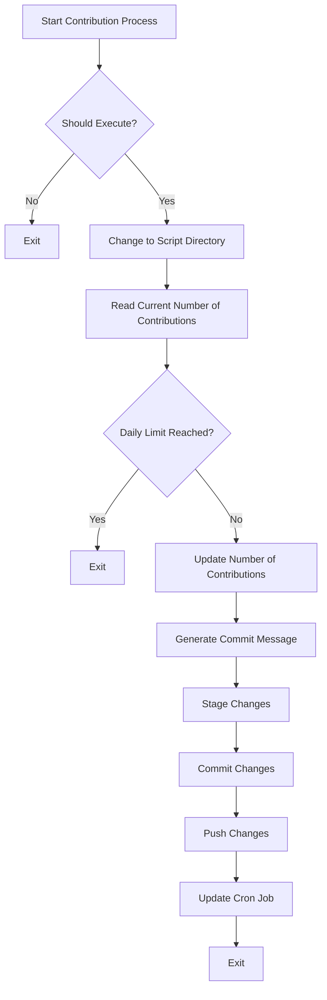

# Contribution Generator

Contribution Generator is a Python application designed to automate the process of making contributions to a Git repository. It reads the current number of contributions, checks if the daily limit is reached, decides whether to execute based on random chance, updates the number of contributions, commits and pushes the changes, and updates the cron job.

## Features

- Automatically generates and commits changes to a Git repository.
- Uses a pre-trained GPT-2 model to generate commit messages following the Conventional Commits standard.
- Configurable daily contribution limits.
- Randomized execution times to simulate natural contribution patterns.

## Workflow



## Installation

### 0. Prerequisites.
   - Python 3.6 or higher.
   - Git.
   - Poetry for dependency management.

### 1. Clone the repository.

```bash
  git clone https://github.com/IJMadalenA/contribution_generator.git
  cd contribution_generator
```

### 2. Install dependencies.

```bash
  poetry install
```

## Set Up the Cron Job
The script includes a function to update the cron job with a random execution time. Ensure the cron job activates the virtual environment before running the script.

This `README.md` file provides a clear and professional overview of your project, including a description, workflow diagram, and installation and setup instructions.